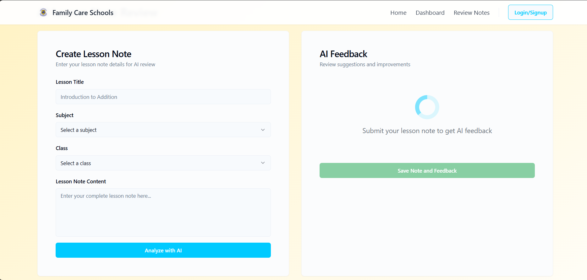

# AI Lesson Note Reviewer




A web application that allows primary school teachers to submit lesson notes for automatic review and feedback using AI. The system provides constructive, AI-generated feedback and scoring based on content quality, grammar, clarity, and relevance.

---

## Project Overview

- **Backend**: Django + Django REST Framework
- **Frontend**: Built with LoveableAI (React-based)
- **Database**: MySQL
- **AI Integration**: Gemini API for content review
- **Authentication**: JWT-based secure login and registration
- **Testing**: Insomnia for API testing

---

## Features

- Teacher registration and secure login
- Create, view, and update lesson notes
- Auto-generate AI feedback for each lesson note
- View multiple feedback entries (AI and/or human)
- Restrict visibility so teachers only see their content
- Manual option to re-trigger AI review

---

## API Endpoints

| Method | Endpoint                                            | Description                                  |
|--------|-----------------------------------------------------|----------------------------------------------|
| POST   | `/api/register/`                                    | Register a new user                          |
| GET/PUT| `/api/profile/`                                     | Get or update the authenticated user profile |
| GET/POST | `/api/teachers/`                                  | List or create teacher profiles              |
| GET/PUT/DELETE | `/api/teachers/{id}/`                       | Get, update, or delete specific teacher      |
| GET/POST | `/api/lesson-notes/`                              | List or create lesson notes                  |
| GET/PUT/DELETE | `/api/lesson-notes/{id}/`                   | Get, update, or delete a lesson note         |
| POST   | `/api/lesson-notes/{id}/generate-ai-feedback/`      | Manually trigger AI feedback generation      |
| GET/DELETE | `/api/lesson-notes/{id}/ai-feedback/`           | Get or delete AI-generated feedback          |
| GET    | `/api/lesson-notes/{id}/feedback/`                  | Get all feedback for a specific lesson note  |
| GET/POST | `/api/feedback/`                                  | List or create feedback manually             |
| GET/PUT/DELETE | `/api/feedback/{id}/`                       | Get, update, or delete a specific feedback   |
| GET    | `/api/feedback/ai-feedback/`                        | List all AI feedback for authenticated user  |
| GET    | `/api/feedback/human-feedback/`                     | List all human feedback for authenticated user |

---

## Authentication

- **JWT Auth** using `djangorestframework-simplejwt`
- Include `Authorization: Bearer <your_token>` in headers

---

## Getting Started (Backend)

```bash
# Clone backend
git clone https://github.com/fkbyjosh/ai_lesson_note_reviewer.git
cd ai_lesson_note_reviewer_backend

# Activate virtual environment
source myenv/bin/activate

# Install dependencies
pip install -r requirements.txt

# Set up MySQL, then migrate
python manage.py makemigrations
python manage.py migrate

# Run server
python manage.py runserver

```

---

## Getting Started (Frontend)

```bash
# Clone frontend
git clone https://github.com/fkbyjosh/ai_lesson_note_reviewer_frontend.git
cd ai_lesson_note_reviewer_frontend

# Install dependencies
npm install

# Run the dev server
npm run dev
```

---

## Project Structure (Backend)

```pgsql
notes/
├── models.py       # Teacher, LessonNote, Feedback models
├── serializers.py  # All serializers for API
├── views.py        # API logic & AI integration
├── urls.py         # Endpoint routing
├── ai_feedback.py  # Gemini API wrapper
```

---

## AI Review Flow

1. Teacher submits a lesson note.

2. Backend automatically calls Gemini API via AIFeedbackGenerator.

3. Feedback is saved and attached to the lesson note.

4. Option to manually re-trigger AI feedback.

---

## Testing with Insomnia

Use Insomnia to:

• Register and login (get JWT token)

• Submit a lesson note

• View or trigger AI feedback

---

## Tech Stack

• Backend: Django, DRF, MySQL, JWT

• Frontend: React (LoveableAI), Vite, TailwindCSS, TypeScript, shadcn-ui

• AI: Gemini API

• Testing: Insomnia

• Version Control: Git + GitHub

---

## To-Do / Future Work

• Admin interface for reviewing flagged notes

• Human-in-the-loop feedback system

• Dashboard with analytics (submission trends, feedback quality)

• Notifications for teachers on review completion

---

## Author 

Joshua Baka

---